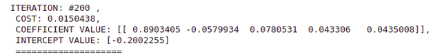
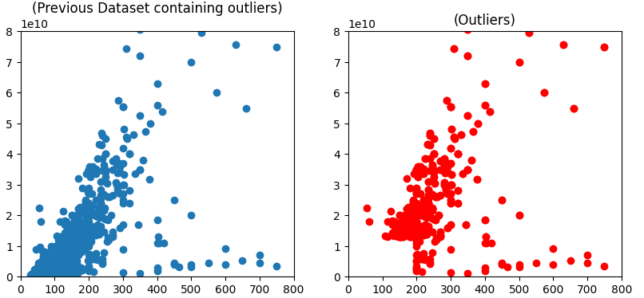

# House Price Prediction using Linear Regression
This repository contains code for House Price prediction using Linear Regression. This project is based on the dataset that can be found through [Tehran (Divar.ir) House Price Prediction](https://www.kaggle.com/code/soheiltehranipour/tehran-divar-ir-house-price-prediction) thanks to [Dr. Soheil Tehranipour](https://www.kaggle.com/soheiltehranipour) who has done a very excellent job in the area of AI and ML. The current repository contains a detailed description of the process of visualization and preprocessing the dataset. This repository also contains a stable version of Linear Regression that can be used in other projects related to Machine Learning.


## Table of Contents
- <a href='#requirements'>Requirements</a>
- <a href='#training-linear-regression'> Training Linear Regression</a>
- <a href='#performance'>Performance</a>
- <a href='#references'>Reference</a>


## Requirements
This project does not need any specific requirements. The dataset, ["Tehran (Divar.ir) House Price Prediction"](https://www.kaggle.com/code/soheiltehranipour/tehran-divar-ir-house-price-prediction), also is included in the repository.
<br><br>


### Dataset and pre-processing

- We currently provided the dataset in the directory `./dataset`. However, the linear regression package can be used with various dataset.  
 
    - Your data directory looks like:
      <br>(Optional) You can change the directory of the dataset when running the `train.py` in terminal.
        ```
        - dataset/
            - __init__.py
            - dataset.py
            - config.py
            - divar_tehran_dataset ...
                - DivarHousePrice.csv

        ```


## Training Linear Regression
- We assume that you have cloned the repository.
- To train Linear Regression using the terminal environment, we assume that the dataset is placed in `./dataset/divar_tehran_dataset/`, so you should simply run the following command. `!python train.py`
By running the following command, you will get more information about the module.
```
>!python train.py -help 
Usage: train.py [options]
Options:
  -h, --help            show this help message and exit
  -p TRAIN_PATH, --path=TRAIN_PATH
                        Path to training data.
  -m METHOD, --method=METHOD
                        choose between 'normal-equation' and 'gradient-descent'
                        default value is 'normal-equation'
```
As you can see above, you can choose either Linear Regression to be based on Gradient Descent or Normal Equation. However, the default method would be "normal-equation".
```
!python train.py -p "./dataset/divar_tehran_dataset/DivarHousePrice.csv" -m "gradient-descent"
```  
<br><br>

### Colaboratory Notebook
Second way to train Linear Regression is to use the `.ipynb` file in the main directory. It is very informative and build up your intuition of the process of pre-processing and make you more knowledgable about the dataset. In addition, you don't even need to clone the repository it can be executed by Google Colaboratory Online.
<br><br>

<center>
 
</center>

## Refrences:

The following list contains several links to every resource that helped us implement this project.

1.   [Kaggle dataset created and developed by Soheil Tehranipour ](https://www.kaggle.com/datasets/soheiltehranipour/divar-posts)
2.   [Maths-MLMaths-ML developed by Farzad Yousefi ](https://github.com/F-Yousefi/Maths-ML)
3.   [Machine Learning published by Coursera ](https://www.coursera.org/specializations/machine-learning-introduction)

